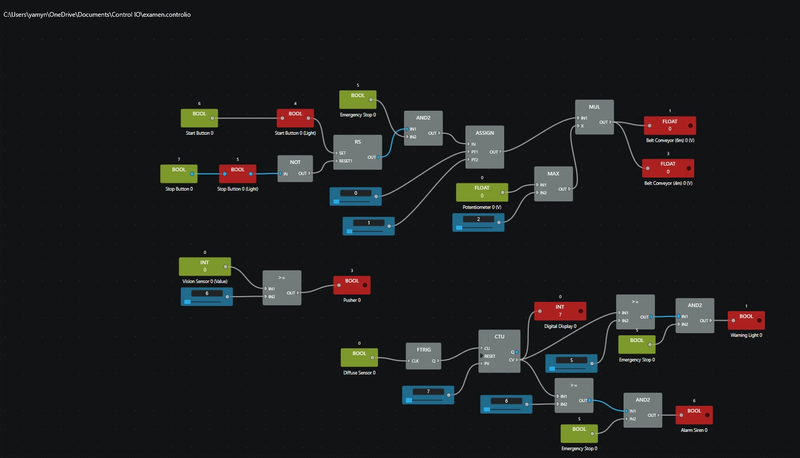
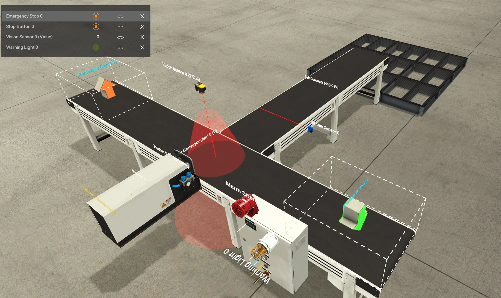
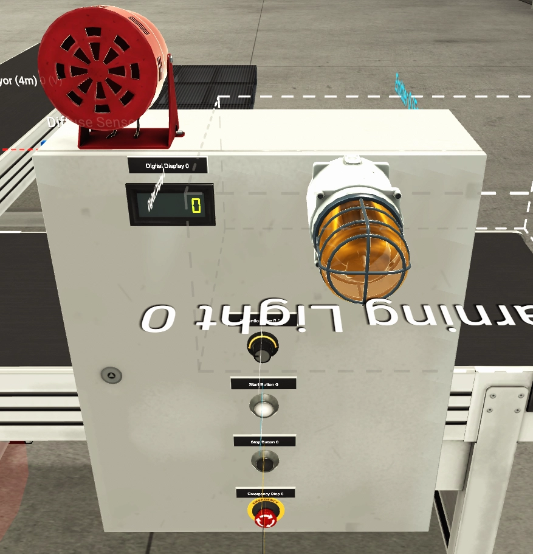

# Projet d'Automatisation - Système de Tri avec Factory I/O et Control I/O

L'objectif de ce projet est de trier et de conserver uniquement les colis ayant une hauteur supérieure ou égale à 6 afin de les envoyer vers une palette XXL. Le système est conçu pour nous avertir dès que le nombre de colis triés dépasse 5. Des dispositifs de sécurité, tels que la `Warning Light 0` et l'`Alarm Siren 0`, se déclenchent pour signaler ce dépassement. Cela permet à l'opérateur de tout interrompre à l'aide de l'`Emergency Stop 0`, ou d'utiliser le `Stop Button 0` standard si ces deux alarmes ne se sont pas encore déclenchées.

## Table de Validation de la Configuration

| Configuration minimale requise | Éléments présents sur le schéma et la scène |
| :--- | :--- |
| **2 Capteurs Booléens** | • `Start Button 0` • `Stop Button 0` • `Diffuse Sensor 0` *(calcule le nombre de colis)* |
| **2 Capteurs Register** | • `Potentiometer 0 (V)` • `Vision Sensor 0 (Value)` *(calcule la hauteur du colis)* |
| **2 Actionneurs Booléens** | • `Pusher 0` • `Warning Light 0` *(s'allume si le nombre de colis poussés pour être gardés est supérieur ou égal à 5)* • `Alarm Siren 0` *(s'allume si on arrive à 6)* • `Start Button 0 (Light)` • `Stop Button 0 (Light)` |
| **2 Actionneurs Register** | • `Belt Conveyor (6m) 0 (V)` • `Belt Conveyor (4m) 0 (V)` • `Digital Display 0` *(affiche le nombre de colis avec une hauteur supérieur ou égal à 6)* |
| **Procédure d’Arrêt d’Urgence** | • `Emergency Stop 0` *(câblé en coupure directe sur les Belt Conveyors, la Warning Light et l'Alarm Siren)* |

---

## Cheminement du Système et Logique Générale

Il s'agit d'un système de tri conçu pour traiter des `Stackable boxes` contenant des `products` à l'intérieur. Le cheminement s'effectue selon le scénario suivant :

1. **Démarrage de la ligne :** Les tapis (`Belt Conveyor`) se mettent à rouler lorsque l'on déclenche le système à l'aide du `Start Button 0`. On peut également régler la vitesse comme on le souhaite sur le `Potentiometer 0 (V)`.
2. **Détection et analyse :** Une fois que le colis passe sous le `Vision Sensor 0 (Value)`, ce dernier détecte sa hauteur. 
3. **Tri automatique :** Si la hauteur détectée est supérieure ou égale à `6`, le `Pusher 0` s'active pour pousser le colis sur le deuxième tapis (`Belt Conveyor 4m`). Sinon, le colis continue sa route tout droit pour être supprimé.
4. **Comptage et Affichage :** Une fois dévié sur le deuxième tapis, le colis passe devant un `Diffuse Sensor 0`. Ce capteur calcule le nombre de colis triés et envoie l'information en temps réel sur notre `Digital Display 0`.
5. **Gestion des alertes :** 
   * Lorsque l'on arrive à `5` colis, la `Warning Light 0` s'allume.
   * Si on arrive à `6` ou plus, l'`Alarm Siren 0` s'allume également.
6. **Contrôle et Sécurisation :** 
   * On peut appuyer sur le `Stop Button 0` à tout moment pour arrêter les tapis.
   * On peut cliquer sur le bouton `Emergency Stop 0` pour stopper instantanément les `Belt Conveyors`, l'alarme sonore (`Alarm Siren 0`) et le voyant d'alerte (`Warning Light 0`).

---

## Architecture Technique sous Control I/O

### 1. Contrôle de la Ligne et Gestion de la Vitesse
* **Marche / Arrêt :** Une bascule `RS` est pilotée par le `Start Button 0` (Set) et le `Stop Button 0` inversé par une porte `NOT` (Reset). 
* **Consigne de Vitesse :** Un `Potentiometer 0 (V)` délivre une consigne analogique. Un bloc `MAX` bride la vitesse minimale à `2.0`. Cette valeur est multipliée via un bloc `MUL` par la sortie filtrée de la bascule `RS` pour piloter les moteurs.

### 2. Reconnaissance Numérique et Tri Robotisé
* La valeur lue par le `Vision Sensor 0 (Value)` est envoyée dans un bloc de comparaison `>=` réglé avec une constante de `6`. La sortie logique pilote directement le `Pusher 0` dès qu'une boîte haute est identifiée.

### 3. Comptage et Alertes Graduées
* Le `Diffuse Sensor 0` est relié à un détecteur de front descendant `FTRIG` pour incrémenter proprement le bloc compteur `CTU`. La sortie courante `CV` alimente le `Digital Display 0`.
* Deux blocs de comparaison `>=` surveillent la valeur du compteur : l'un est réglé sur `5` pour activer la `Warning Light 0`, et l'autre sur `6` pour déclencher l'`Alarm Siren 0`.

### 4. Scénario de Sécurité (Emergency Stop)
Pour garantir un arrêt immédiat sans conflit de type de données, le bouton `Emergency Stop 0` agit de façon isolée à l'aide de trois portes logiques distinctes :
* **Sur les tapis :** Une porte `AND2` intercepte le signal marche entre la bascule `RS` et le bloc `ASSIGN`. L'appui sur le coup de poing coupe instantanément l'autorisation de rouler des `Belt Conveyors`.
* **Sur les alertes :** Une porte `AND2` est intercalée juste avant l'actionneur `Warning Light 0` et une autre juste avant l'actionneur `Alarm Siren 0`. Dès que l'arrêt d'urgence est déclenché, ces portes forcent les deux alarmes à s'éteindre immédiatement.

---

## Visuels du Système

1. Schéma logique Control I/O mettant en évidence le câblage propre des blocs logiques, arithmétiques et de comptage ainsi que l'interconnexion de l'arrêt d'urgence. 
  
2. Vue d'ensemble de la scène Factory I/O illustrant la disposition générale des `Belt Conveyors`, le `Vision Sensor 0` et le `Pusher 0`. 
  
3. Gros plan sur le boîtier électrique équipé du `Potentiometer 0 (V)`, du `Digital Display 0`, des voyants Marche/Arrêt et du bouton  `Emergency Stop 0`.
  